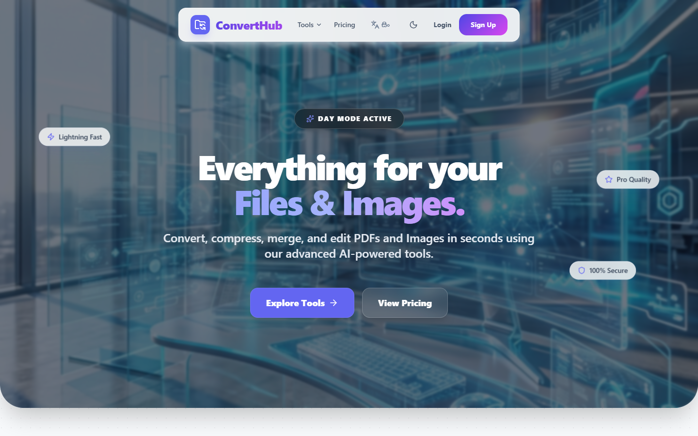
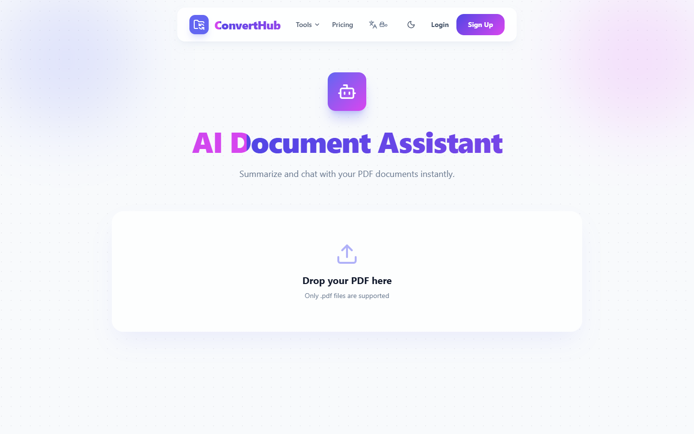
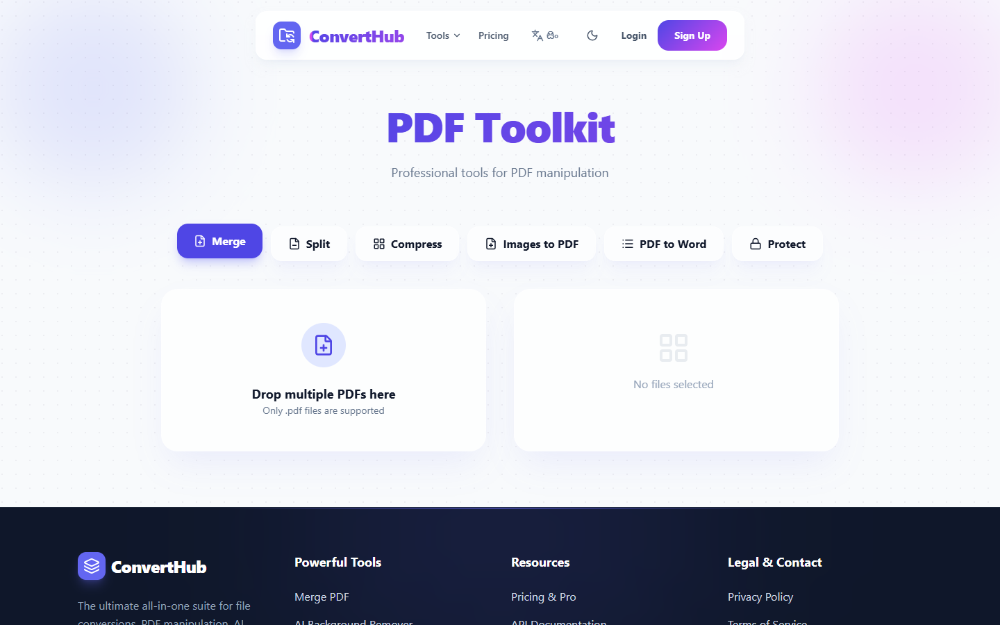
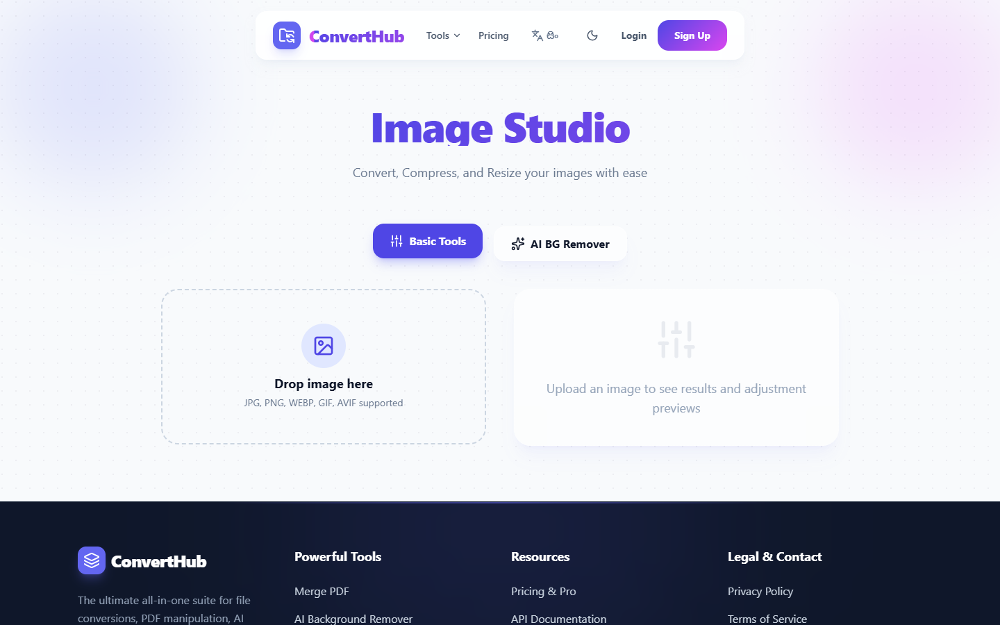
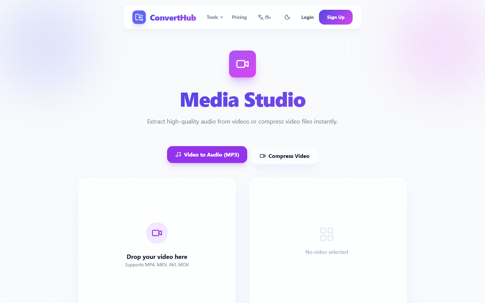
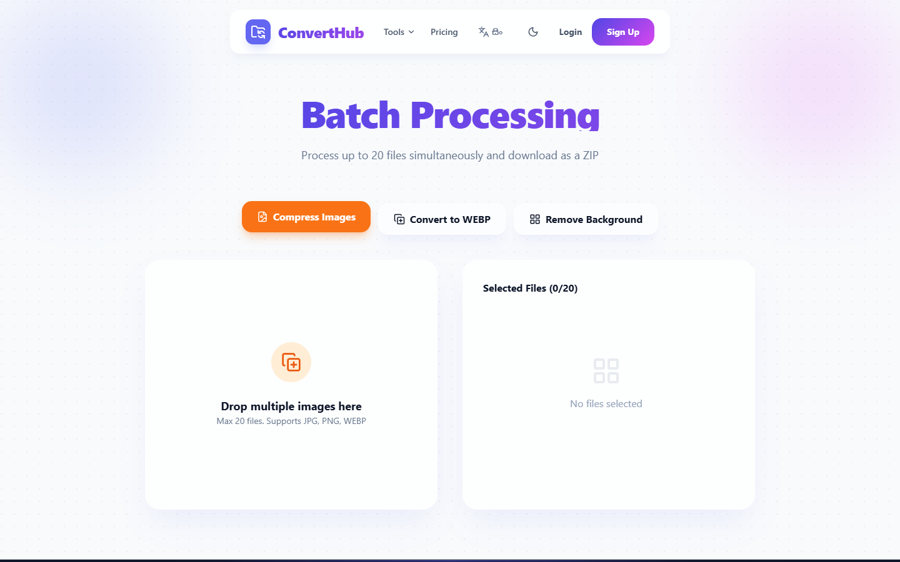
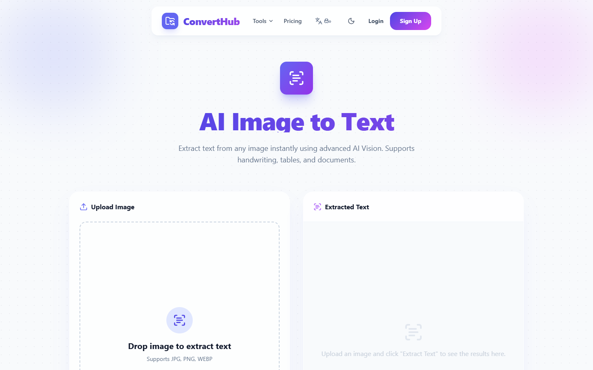
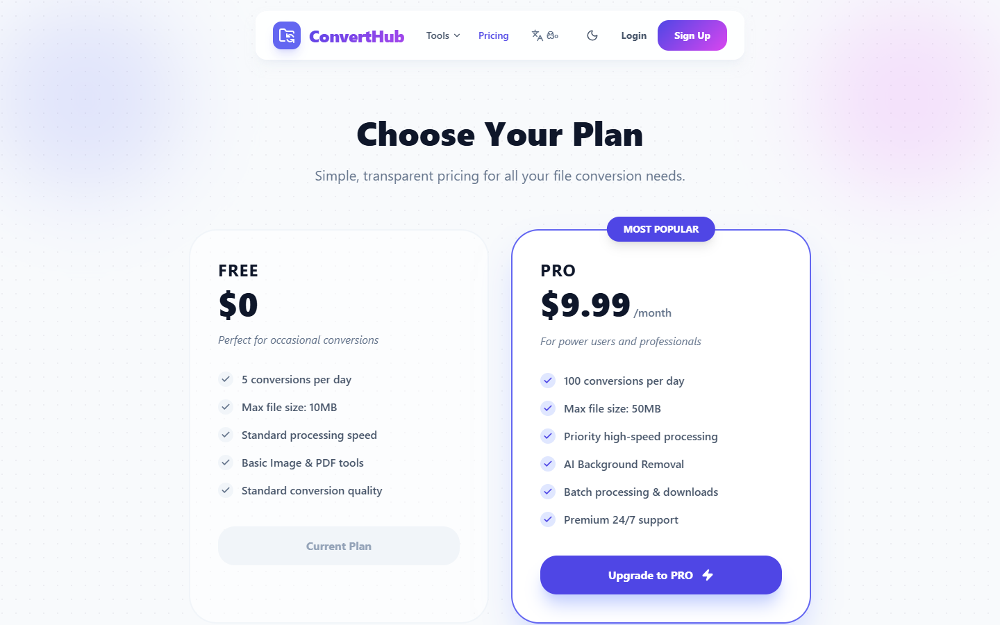

# 🚀 ConvertHub - Advanced File & Image Converter SaaS

ConvertHub is a modern, high-performance, full-stack file converter application built with the MERN stack. It offers real-time file conversion, PDF tools, AI-powered document analysis, Batch Processing, Optical Character Recognition (OCR), Text-to-Speech (TTS), and web page captures.

---

## 📸 Screenshots

### 🏠 Landing Page


### 🤖 AI Assistant (Gemini powered document helper)


### 📑 PDF Toolkit (Merge, Split, Protect, and more)


### 🖼️ Image Tools (Format conversion, resize, compress)


### 🎥 Media Converter (Audio & Video format tools)


### 📦 Batch Processing (Convert multiple files simultaneously)


### 🔍 OCR Scanner (Extract text from images & PDFs)


### 💳 Pricing & Subscriptions (Stripe Integration)


---

## ✨ Features & Architecture

ConvertHub isn't just a basic converter; it's a enterprise-grade SaaS application designed to handle high load and background operations efficiently.

### Core Modules
- **⚡ Core File Converter:** Seamlessly convert files between multiple formats (PDF, DOCX, Images, Audio, Video).
- **🤖 Gemini AI Assistant:** Upload documents and chat with them using built-in Google Gemini AI.
- **📑 Comprehensive PDF Toolkit:**
  - Merge and Split PDFs.
  - Compress and Protect/Encrypt PDFs.
- **🖼️ Image Optimization:** Compression, resizing, cropping, and format changes (PNG, JPG, WebP).
- **📦 Batch Processing:** Upload and queue multiple conversions in parallel using Bull queue & Redis.
- **🔍 OCR & Scanner:** Extract text from image uploads and PDFs using Tesseract.js.
- **🎥 Media Processing:** Convert video and audio formats using `fluent-ffmpeg` and `ffmpeg-static`.
- **🗣️ Text-to-Speech (TTS):** Convert typed text into downloadable audio files.
- **🌐 Web Page Capture:** Input a URL and convert the page to a PDF or Image.
- **💳 Subscriptions & Monetization:** Stripe-integrated pricing plans (Monthly/Annual subscription plans).
- **🔒 Authentication:** Secure JWT-based auth + Google OAuth 2.0 integration.

### Technical & System Highlights
* **Redis & Bull Queue**: Long-running media conversions and heavy PDF operations are offloaded to background jobs so they do not block the main Node.js event loop.
* **Socket.io Real-time Logs**: Notifies user immediately when background conversion status updates (Queued ➜ Processing ➜ Completed/Failed).
* **Automatic File Cleanup**: Scheduled cron jobs run periodically to delete uploads/converted files from the server, maintaining storage health.
* **Security First**: Utilizes Helmet.js headers, Express rate-limiting, and CORS configurations. Secure JWT authentication is handled via signed HTTP-only cookies.

---

## 🛠️ Tech Stack

### Frontend
- **React 19** & **Vite**
- **TailwindCSS** (Responsive, Modern UI)
- **Framer Motion** (Smooth Page & Element Animations)
- **React Dropzone** & **Lucide Icons**
- **Socket.io Client** (Real-time updates)

### Backend
- **Express.js** & **Node.js**
- **MongoDB** & **Mongoose** (Database)
- **Redis** & **Bull Queue** (Asynchronous background file conversion)
- **Socket.io** (Real-time task completion notifications)
- **Puppeteer** (Web page capture)
- **Stripe SDK** (Payment processing)
- **Tesseract.js** (OCR Engine)

---

## 🔌 API Endpoint Reference

### Authentication (`/api/auth`)
* `POST /register` - Register a new user
* `POST /login` - Log in a user and set cookies
* `POST /logout` - Log out a user and clear sessions
* `GET /me` - Get profile of authenticated user

### File Operations (`/api/files`)
* `POST /convert` - Single file upload and conversion request
* `GET /history` - Get user conversion history list
* `GET /status/:id` - Fetch conversion progress/status
* `GET /download/:id` - Download converted file

### PDF Operations (`/api/pdf`)
* `POST /merge` - Merge up to 10 PDF files
* `POST /split` - Split PDF into single pages
* `POST /compress` - Compress PDF file size
* `POST /to-docx` - Convert PDF document to Microsoft Word format
* `POST /protect` - Encrypt PDF with password protection
* `POST /images-to-pdf` - Convert multiple image files into a single PDF

### Image Processing (`/api/images`)
* `POST /process` - Basic image actions (Resize, compress, convert formats)
* `POST /remove-bg` - Remove image backgrounds using Photoroom API
* `POST /batch` - Process multiple images in a queue

### Video & Audio Operations (`/api/media`)
* `POST /compress-video` - Compress video files using `fluent-ffmpeg`
* `POST /extract-audio` - Extract high-quality MP3 audio from video files

### Advanced Features (`/api/extra` & `/api/ai` & `/api/batch`)
* `POST /api/extra/web-capture` - Convert webpage URLs to PDFs or images using Puppeteer
* `POST /api/extra/tts` - Translate typed text to downloadable audio files
* `POST /api/ai/chat` - Analyze and discuss documents with Google Gemini AI
* `POST /api/batch/process` - Handle multi-file bulk operations

---

## 🚀 Getting Started

### Prerequisites
- Node.js (v18+)
- MongoDB (Atlas or Local)
- Redis instance (Upstash or Local)

### Setup Environment Files

#### Client Environment (`./client/.env`)
```env
VITE_API_URL=http://localhost:5000/api
VITE_SERVER_URL=http://localhost:5000
VITE_GOOGLE_CLIENT_ID=your_google_client_id
VITE_STRIPE_PUBLISHABLE_KEY=your_stripe_publishable_key
```

#### Server Environment (`./server/.env`)
```env
PORT=5000
NODE_ENV=development
FRONTEND_URL=http://localhost:5173
MONGODB_URI=your_mongodb_uri
JWT_SECRET=your_jwt_secret
COOKIE_SECRET=your_cookie_secret
REDIS_ENABLED=true
REDIS_HOST=your_redis_host
REDIS_PORT=6379
REDIS_PASSWORD=your_redis_password
REDIS_TLS=true
GEMINI_API_KEY=your_gemini_api_key
GOOGLE_CLIENT_ID=your_google_client_id
GOOGLE_CLIENT_SECRET=your_google_client_secret
STRIPE_SECRET_KEY=your_stripe_secret_key
STRIPE_PRICE_ID=your_stripe_price_id
STRIPE_WEBHOOK_SECRET=your_stripe_webhook_secret
```

### Installation & Run

1. **Clone the repository:**
   ```bash
   git clone https://github.com/sithumcha/converthub.git
   cd converthub
   ```

2. **Run Backend Server:**
   ```bash
   cd server
   npm install
   npm run dev
   ```

3. **Run Frontend Client:**
   ```bash
   cd ../client
   npm install
   npm run dev
   ```

4. **Using Docker:**
   You can run the full ecosystem with docker-compose:
   ```bash
   docker-compose up --build
   ```
